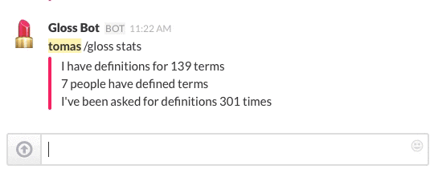

# Glossary Bot

Glossary Bot is a Slack bot that maintains a glossary of terms created by its users, and responds to requests with definitions.

It is a simple web app designed to be used as a [Slack integration](https://slack.com/integrations). Specifically, it responds to POSTs created by the Slack *Slash Commands* integration and responds with messages to Slack's *Incoming Webhooks* integration.

#### Deploy Glossary Bot

Glossary Bot is a [Flask](http://flask.pocoo.org/) app built to run on [Heroku](https://heroku.com/). To deploy the bot using Heroku's automated setup, see below. To deploy or upgrade the bot from the command line, read [DEPLOY](DEPLOY.md). To install the bot locally for development and testing, read [INSTALL](INSTALL.md).

#### Set Up on Slack

Glossary Bot uses two Slack integrations: [Slash Commands](https://api.slack.com/slash-commands) for private communication between the bot and the user, and [Incoming Webhooks](https://api.slack.com/incoming-webhooks) for posting public messages.

[Set up a Slash Command integration](https://my.slack.com/services/new/slash-commands). There are three critical values that you need to set or save: **Command** is the command people on Slack will use to communicate with the bot. We use `/gloss`. **URL** is the public URL where the bot will live; **LEAVE THIS PAGE OPEN** so that you can fill this in after you've deployed the application to Heroku, as described below. **Token** is used to authenticate communication between Slack and the bot; save this value for when you're setting up the bot on Heroku.

[Set up an Incoming Webhooks integration](https://my.slack.com/services/new/incoming-webhook). The first important values here is **Post to Channel**, which is a default channel where public messages from the bot will appear. This default is always overridden by the bot, but you do need to have one – we created a new channel called *#glossary-bot* for this purpose. Save the value of **Webhook URL**; this is the URL that the bot will POST public messages to, and you'll need it when setting up Gloss Bot on Heroku.

#### Deploy on Heroku

Click the button above to get started. In the form that loads, add a name for your bot in the **App Name** field, or leave it blank to have Heroku generate a unique name. You won't see this name in Slack, it'll just be part of the URL that Slack uses to communicate with the bot behind the scenes.

Paste the **Token** from the Slash Command integration into the `SLACK_TOKEN` field and the **Webhook URL** from the Incoming Webhooks integration into the `SLACK_WEBHOOK_URL` field. Now click the **Deploy for Free** button to deploy the bot!

When it's done deploying, click the **View** button at the bottom of the form. A **Method Not Allowed** error page will load, but don't worry about that. All you're looking for is your bot's URL, which looks something like `https://my-glossary-bot.herokuapp.com/`. Copy that URL, paste it into the **URL** field of the Slash Command integration page on Slack, and save the integration there.

And now you're good to get glossing! Open up Slack and type `/gloss help` to start.
